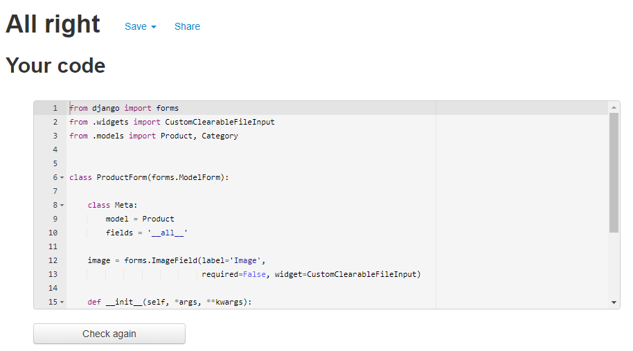

# Testing

## [W3C Markup Validation Service](https://validator.w3.org/)

- HTML

## [W3C CSS Validation Service](https://jigsaw.w3.org/css-validator/)

- CSS

## [JSHint Validator](https://jshint.com/)

- JS 

## [PEP8 Python Validation](http://pep8online.com/)

### crypto_store App

- settings.py

    

- urls.py

    

- views.py

    

### Home App

- admin.py

    

- app.py

    

- forms.py

    

- models.py

    

- urls.py

    

- views.py

    

### Products App

- admin.py

    

- app.py

    

- forms.py

    

- models.py

    

- urls.py

    

- views.py

    

- widgets.py

    

### Bag App

- app.py

    

- contexts.py

    

- urls.py

    

- views.py

    

### Checkout App

- admin.py

    

- app.py

    

- forms.py

    

- models.py

    

- urls.py

    

- views.py

    

- signals.py

    

### Profiles App

- app.py

    

- forms.py

    

- models.py

    

- urls.py

    

- views.py

    

### Wishlist App

- app.py

    

- admin.py

    

- models.py

    

- urls.py

    

- views.py

    

### Root Level Files

- custom_storages.py

    

- manage.py

    

## Lighthouse Score

### Mobile:

### Desktop:

## User Story Tests

## Manual Testing

## Responsiveness Testing

Mobile

## Browser Compatibility Tests 

I will test cMarket on [Firefox](https://www.mozilla.org/en-GB/firefox/new/), [Microsoft Edge](https://www.microsoft.com/en-us/edge) and [Brave Browser](https://brave.com/):

### Firefox:

### Microsoft Edge:

### Brave Browser:

## GitHub Issues

When developing the project, I used GitHub Issues as a way to track my work on GitHub, and make notes of any bugs or features that I needed to fix/implement.

- [Here]() you can find a list of open issues, which are made up of various User Stories or Dvelopment tasks that needed completing.

- [Here]() you can find a list of all closed issues, which show any bugs I resolved.

## Bugs
