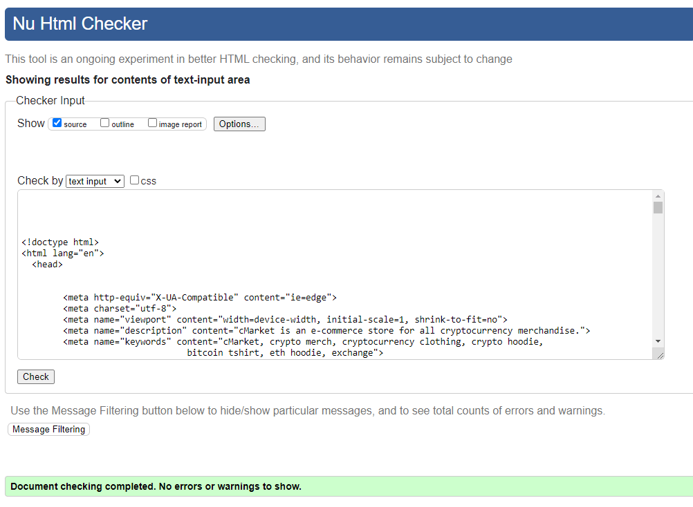
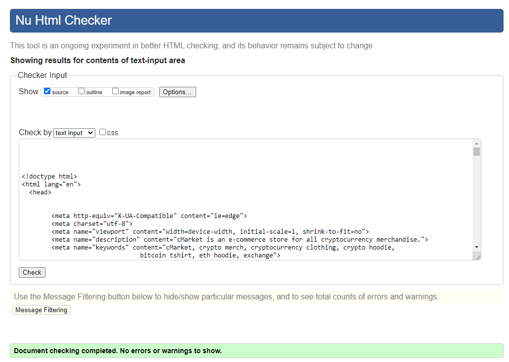
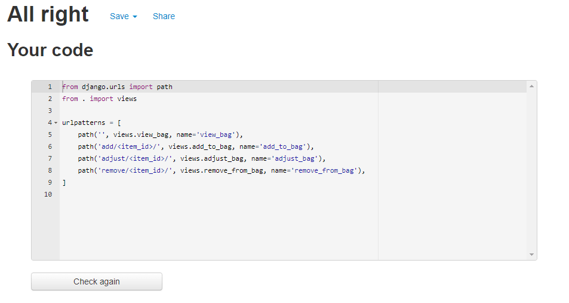
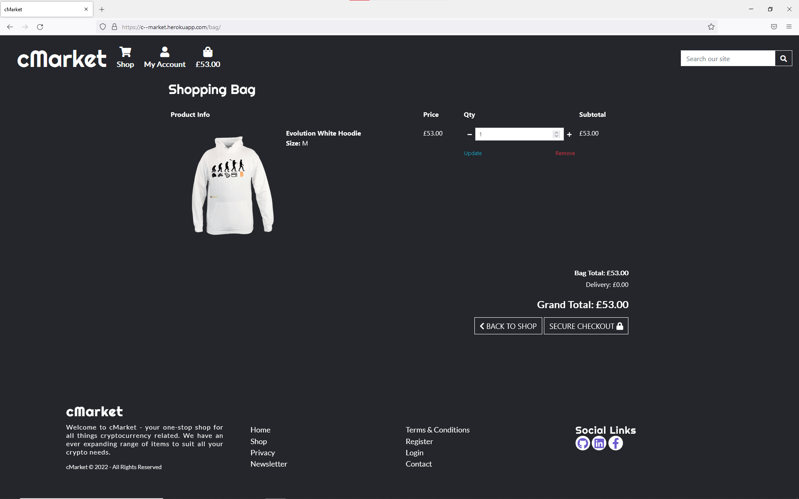

# Testing

## [W3C Markup Validation Service](https://validator.w3.org/)

HTML Validation

Page                    | Image
--------------------    | ---------------
Home                    | 
Accounts                | 
Products                | 
Product Details         | 
Bag                     | 
Checkout                | 
Wishlist                | 
Profile                 | 
Product Management      | 
Contact                 | 
Newsletter              | 
Privacy & T&C's         | 

## [W3C CSS Validation Service](https://jigsaw.w3.org/css-validator/)

## [JSHint Validator](https://jshint.com/)

- JS 

## [PEP8 Python Validation](http://pep8online.com/)

cMarket Main App

Python Files  | PEP8 result
------------- | -------------
settings.py   | 
urls.py       | 
views.py      | 

Home App

Python Files  | PEP8 result
------------- | -------------
admin.py      | 
app.py        | 
urls.py       | 
views.py      | 
forms.py      | 
models.py     | 

Products App

Python Files  | PEP8 result
------------- | -------------
admin.py      | 
app.py        | 
urls.py       | 
views.py      | 
forms.py      | 
models.py     | 
widgets.py    | 

Bag App

Python Files  | PEP8 result
------------- | -------------
app.py        | 
urls.py       | 
views.py      | 
contexts.py   | 

Checkout App

Python Files  | PEP8 result
------------- | -------------
admin.py      | 
app.py        | 
urls.py       | 
views.py      | 
forms.py      | 
models.py     | 
signals.py    | 

Profiles App

Python Files  | PEP8 result
------------- | -------------
app.py        | 
urls.py       | 
views.py      | 
forms.py      | 
models.py     | 

Wishlist App

Python Files  | PEP8 result
------------- | -------------
app.py        | 
admin.py      | 
urls.py       | 
views.py      | 
models.py     | 

Root Level Files

Python Files            | PEP8 result
--------------------    | ---------------
custom_storages.py      | 
manage.py               | 

Root Level Files

Python Files            | PEP8 result
--------------------    | ---------------
custom_storages.py      | 
manage.py               | 

## Lighthouse Score

Results

Device                  | Lighthouse Score
--------------------    | ---------------
Desktop                 | 
Mobile                  | 

## User Story Tests

### General, site purpose, navigation:

1. As a visiting user I can easily find out what the purpose of the website is and learn more about the site owner and the products being sold so that I can decide to stay and browse or not

2. As a site user I can navigate the site so that I can find the page I want to go to

3. As a user I can find the sites social media accounts so that I can follow them on social media to keep up to date with the business

4. As a site user I can sign up to the newsletter so that I can stay informed and stay engaged with the shop

5. As a site user I can see a 'Page not found' page with consistent branding to the rest of the site, when I try to access a page in error so that I can find my way back to the website and know I have not left the website. Ensure page tells user which error they are getting.

6. As a site user I can find the terms of use and privacy policy so that I can read these documents and have trust in the site

7. As a user I can click on a back to top button so that I can get back to the top of the page without having to scroll

8. As a user I can see a message confirming my actions (e.g. adding item to bag) so that I know my changes were received

9. As a user I can quickly see which section of the website I am in from the main header so that I know which part of the website I am in and can navigate around easily

### Shop - Viewing Products:

10. As a site user I can easily view all the products in the shop so that I can see all the available products immediately without having to sort or filter or take any action

11. As a site user I can view an individual item details so that I can see the full details including the description and decide whether to buy

12. As a site user I can select a specific category of product so that I can view just the items in that category to make it easier to make a decision

13. As a site user I can sort the products in the shop so that I can find what I'm looking for easier

14. As a site user I can search for a product in the shop so that I can find a particular item quickly

15. As a user I can see the results for my filter option or search term so that I can quickly see how many products match my filter option/match my search term

### Shop - Adding to/updating the cart:

16. As a site user I can add an item to my cart so that I can buy it

17. As a site user I can select the quantity of an item before adding to my cart so that I can add multiple of that item at once

18. As a site user I can see the total amount currently in my cart at all times so that I can keep track of how much I'll be spending

19. As a site user I can see the items in my cart at any time so that I can check what I have already added to the cart

20. As a site user I can adjust the quantity of a particular item in the cart so that I can buy more or less of the item directly from the cart

21. As a site user I can remove an item from my cart so that I do not have to buy it if I've changed my mind

### Shop - Payment & Checkout:

22. As a site user I can continue to the checkout process once I've decided on my purchase so that I can buy the items

23. As a site user I can enter my delivery and payment details so that I can complete my purchase

24. As a site user I can see the order summary while making payment so that I can still edit the details before payment if I made a mistake

25. As a registered user I can save my delivery information when checking out so that it is saved to my profile for use with my next order

26. As a site user I can see an order confirmation page so that I know that the order went through okay

27. As a site user I can receive an email confirmation of my order so that I have this confirmation for my records

28. As a user I can see a preview of my shopping cart when I make changes so that I can easily see the new cart

29. As a site owner I can ensure that an order is created once payment is made so that a customer does not make a payment, without an order being created in the database

### User account setup, sign in and out:

30. As a site user I can sign up for an account so that I can enjoy the benefits of having an account with the site

31. As a site user I want to receive an email confirmation when I register so that I know my account registration was successful and secure

32. As a registered user I can sign into my account so that I can access my profile to view all past orders

33. As a registered user I can sign out of my account when finished so that I know I am signed out securely

34. As a registered user I can easily see if I am signed into my account or not so that I know straight away if I need to sign in

### User Profile:

35. As a registered user I can update my default delivery information in my profile so that the updated details are recorded for future orders

36. As a registered user I can see my previous orders in my profile so that I can see all the orders I made and can find details of a previous order

37. As a registered user I can view details of a previous order so that I can check what was ordered and where it was delivered to

38. As a registered user I can easily navigate within the My Account pages so that I understand what pages are available and can get to them easily and I know what page I am on

### Admin for Shop Page:

39. As a website owner I can view all the products in the shop, even if they are not active, so that I can see an overview of all products, and so that I can edit inactive products

40. As a website owner I can add a new product to the shop so that I can sell the product to customers

41. As a website owner I can edit the details of a product in the shop so that I can change the price, description etc. and customers will see the updated information

42. As a website owner I can turn on or off the active flag on a product so that I can add or remove it from appearing in the shop for customers when it is in/out of stock

43. As a website owner I can delete a product so that it will not appear in the shop

44. As a website owner I can access the Django admin site for the categories so that I can add, edit or delete categories from here and new products for these categories can be added to the shop

45. As a site owner I can access the Django admin site for the products so that I can view, edit, delete products from here as well as from the website

46. As a website owner I can see orders in the admin site so that I can access the order details and fulfil the orders

47. As a website owner I can add a product and the sku is created automatically so that the sku's for the products are standardised and I do not have to manually add a sku

48. As a website owner I can have the sku of a product updated when the category is changed so that the sku of the product is reflects the new category

### Admin for User Profiles:

49. As a site owner I can access the Django admin site for Profiles so that I can view user profiles

### Marketing / SEO

50. As a website owner I want my website to contain relevant keywords so that users searching for these keywords will be more likely to find my website in web search results

51. As a website owner I have a link to the Facebook business page on the website so that customers or visitors to the website can follow the Facebook page and I can generate more business through the Facebook page

52. As a website owner I have relevant keywords included in the webpage metadata so that it helps improve SEO so that users searching for these keywords can find my website

53. As a website owner I can have a sitemap.xml and robots.txt file created for the website so that search engines can crawl the essential pages of the site and therefore users can find the site when searching key terms in search engine searches

## Manual Testing

## Responsiveness Testing

Mobile (320px)

Page                    | Image
--------------------    | ---------------
Home                    | 
Accounts                | 
Products                | 
Product Details         | 
Bag                     | 
Checkout                | 
Wishlist                | 
Profile                 | 
Product Management      | 
Contact                 | 
Newsletter              | 
Privacy & T&C's         | 

Mobile (375px)

Page                    | Image
--------------------    | ---------------
Home                    | 
Accounts                | 
Products                | 
Product Details         | 
Bag                     | 
Checkout                | 
Wishlist                | 
Profile                 | 
Product Management      | 
Contact                 | 
Newsletter              | 
Privacy & T&C's         | 

Mobile (425px)

Page                    | Image
--------------------    | ---------------
Home                    | 
Accounts                | 
Products                | 
Product Details         | 
Bag                     | 
Checkout                | 
Wishlist                | 
Profile                 | 
Product Management      | 
Contact                 | 
Newsletter              | 
Privacy & T&C's         | 

Tablet (768px)

Page                    | Image
--------------------    | ---------------
Home                    | 
Accounts                | 
Products                | 
Product Details         | 
Bag                     | 
Checkout                | 
Wishlist                | 
Profile                 | 
Product Management      | 
Contact                 | 
Newsletter              | 
Privacy & T&C's         | 

Desktop (1024px & 1440px)

Page                    | Image
--------------------    | ---------------
Home                    | 
Accounts                | 
Products                | 
Product Details         | 
Bag                     | 
Checkout                | 
Wishlist                | 
Profile                 | 
Product Management      | 
Contact                 | 
Newsletter              | 
Privacy & T&C's         | 

## Browser Compatibility Tests 

I will test cMarket on [Brave Browser](https://brave.com/), [Microsoft Edge](https://www.microsoft.com/en-us/edge) and [Firefox](https://www.mozilla.org/en-GB/firefox/new/):  

Brave Browser

Page                    | Image
--------------------    | ---------------
Home                    | 
Accounts                | 
Products                | 
Product Details         | 
Bag                     | 
Checkout                | 
Wishlist                | 
Profile                 | 
Product Management      | 
Contact                 | 
Newsletter              | 
Privacy & T&C's         | 

Microsoft Edge

Page                    | Image
--------------------    | ---------------
Home                    | 
Accounts                | 
Products                | 
Product Details         | 
Bag                     | 
Checkout                | 
Wishlist                | 
Profile                 | 
Product Management      | 
Contact                 | 
Newsletter              | 
Privacy & T&C's         | 

Firefox

Page                    | Image
--------------------    | ---------------
Home                    | 
Accounts                | 
Products                | 
Product Details         | 
Bag                     | 
Checkout                | 
Wishlist                | 
Profile                 | 
Product Management      | 
Contact                 | 
Newsletter              | 
Privacy & T&C's         | 

## GitHub Issues

When developing the project, I used GitHub Issues as a way to track my work on GitHub, and make notes of any bugs or features that I needed to fix/implement.

- [Here](https://github.com/RiyadhKh4n/cmarket/issues?q=is%3Aissue+is%3Aclosed) you can find a list of all issues used for the development of cMarket 

## Bugs
