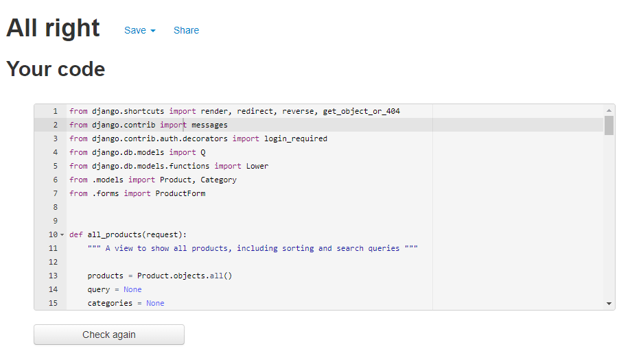
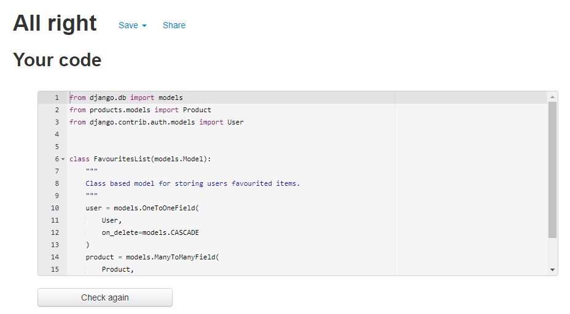

# Testing

## [W3C Markup Validation Service](https://validator.w3.org/)

- HTML

## [W3C CSS Validation Service](https://jigsaw.w3.org/css-validator/)

## [JSHint Validator](https://jshint.com/)

- JS 

## [PEP8 Python Validation](http://pep8online.com/)

cMarket Main App

Python Files  | PEP8 result
------------- | -------------
settings.py   | 
urls.py       | 
views.py      | 

Home App

Python Files  | PEP8 result
------------- | -------------
admin.py      | 
app.py        | 
urls.py       | 
views.py      | 
forms.py      | 
models.py     | 

Products App

Python Files  | PEP8 result
------------- | -------------
admin.py      | 
app.py        | 
urls.py       | 
views.py      | 
forms.py      | 
models.py     | 
widgets.py    | 

Bag App

Python Files  | PEP8 result
------------- | -------------
app.py        | 
urls.py       | 
views.py      | 
contexts.py   | 

Checkout App

Python Files  | PEP8 result
------------- | -------------
admin.py      | 
app.py        | 
urls.py       | 
views.py      | 
forms.py      | 
models.py     | 
signals.py    | 

Profiles App

Python Files  | PEP8 result
------------- | -------------
app.py        | 
urls.py       | 
views.py      | 
forms.py      | 
models.py     | 

Wishlist App

Python Files  | PEP8 result
------------- | -------------
app.py        | 
admin.py      | 
urls.py       | 
views.py      | 
models.py     | 

Root Level Files

Python Files            | PEP8 result
--------------------    | ---------------
custom_storages.py      | 
manage.py               | 

Root Level Files

Python Files            | PEP8 result
--------------------    | ---------------
custom_storages.py      | 
manage.py               | 

## Lighthouse Score

Results

Device                  | Lighthouse Score
--------------------    | ---------------
Desktop                 | 
Mobile                  | 

## User Story Tests

## Manual Testing

## Responsiveness Testing

Mobile (320px)

Page                    | Image
--------------------    | ---------------
Home                    | 
Accounts                | 
Products                | 
Product Details         | 
Bag                     | 
Checkout                | 
Wishlist                | 
Profile                 | 
Product Management      | 
Contact                 | 
Newsletter              | 
Privacy & T&C's         | 

Mobile (375px)

Page                    | Image
--------------------    | ---------------
Home                    | 
Accounts                | 
Products                | 
Product Details         | 
Bag                     | 
Checkout                | 
Wishlist                | 
Profile                 | 
Product Management      | 
Contact                 | 
Newsletter              | 
Privacy & T&C's         | 

Mobile (425px)

Page                    | Image
--------------------    | ---------------
Home                    | 
Accounts                | 
Products                | 
Product Details         | 
Bag                     | 
Checkout                | 
Wishlist                | 
Profile                 | 
Product Management      | 
Contact                 | 
Newsletter              | 
Privacy & T&C's         | 

Tablet (768px)

Page                    | Image
--------------------    | ---------------
Home                    | 
Accounts                | 
Products                | 
Product Details         | 
Bag                     | 
Checkout                | 
Wishlist                | 
Profile                 | 
Product Management      | 
Contact                 | 
Newsletter              | 
Privacy & T&C's         | 

Desktop (1024px & 1440px)

Page                    | Image
--------------------    | ---------------
Home                    | 
Accounts                | 
Products                | 
Product Details         | 
Bag                     | 
Checkout                | 
Wishlist                | 
Profile                 | 
Product Management      | 
Contact                 | 
Newsletter              | 
Privacy & T&C's         | 

## Browser Compatibility Tests 

I will test cMarket on [Firefox](https://www.mozilla.org/en-GB/firefox/new/), [Microsoft Edge](https://www.microsoft.com/en-us/edge) and [Brave Browser](https://brave.com/):

Brave Browser

Page                    | Image
--------------------    | ---------------
Home                    | 
Accounts                | 
Products                | 
Product Details         | 
Bag                     | 
Checkout                | 
Wishlist                | 
Profile                 | 
Product Management      | 
Contact                 | 
Newsletter              | 
Privacy & T&C's         | 

Microsoft Edge

Page                    | Image
--------------------    | ---------------
Home                    | 
Accounts                | 
Products                | 
Product Details         | 
Bag                     | 
Checkout                | 
Wishlist                | 
Profile                 | 
Product Management      | 
Contact                 | 
Newsletter              | 
Privacy & T&C's         | 

Firefox

Page                    | Image
--------------------    | ---------------
Home                    | 
Accounts                | 
Products                | 
Product Details         | 
Bag                     | 
Checkout                | 
Wishlist                | 
Profile                 | 
Product Management      | 
Contact                 | 
Newsletter              | 
Privacy & T&C's         | 

### Firefox:

### Microsoft Edge:

### Brave Browser:

## GitHub Issues

When developing the project, I used GitHub Issues as a way to track my work on GitHub, and make notes of any bugs or features that I needed to fix/implement.

- [Here]() you can find a list of open issues, which are made up of various User Stories or Dvelopment tasks that needed completing.

- [Here]() you can find a list of all closed issues, which show any bugs I resolved.

## Bugs
